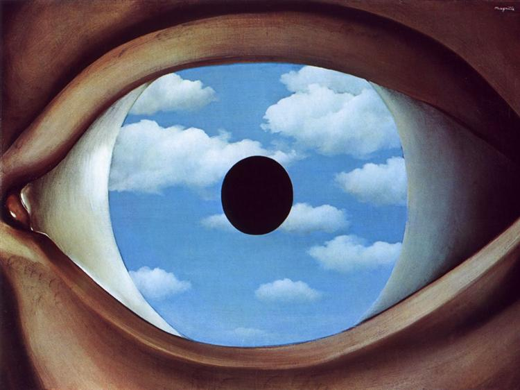
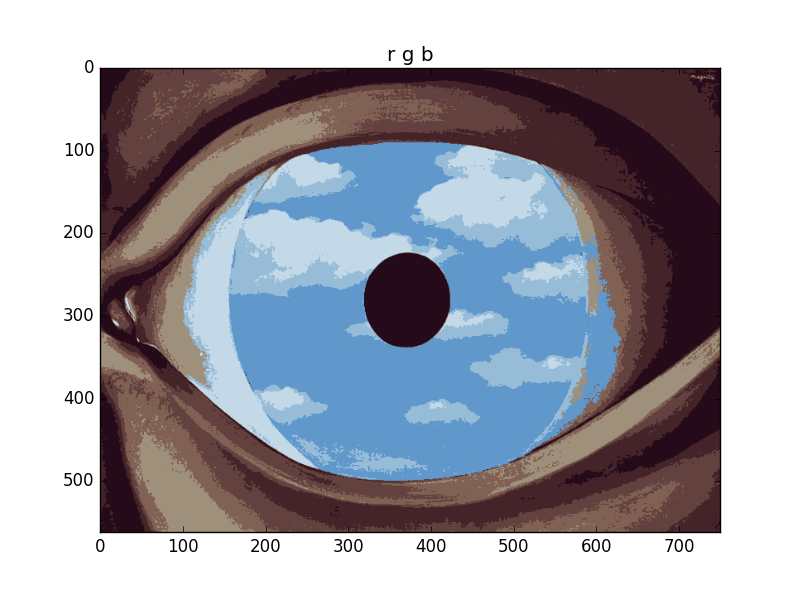
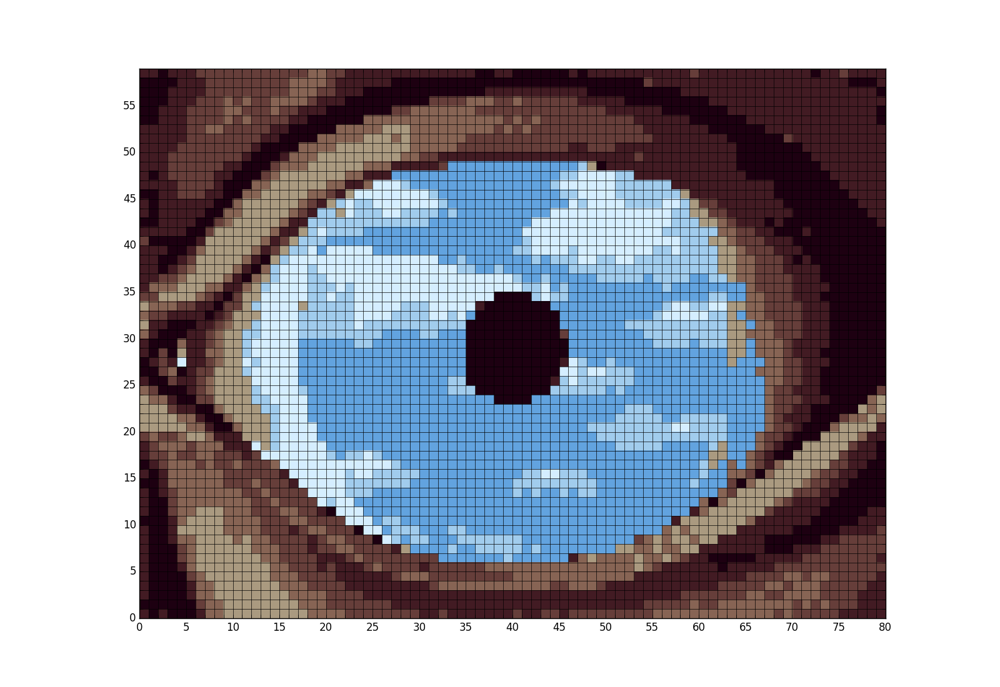

# cross_stitchofy
Makes a cross stitch pattern from a picture. You can specify the scale of your pattern, the number of colors you want, and the type of clustering you want (rgb or hsv). You can also play around with how your pattern is saved so that it's easy to read. Colors are clustered before downsampling.. sometimes the opposite is better. Change lines 78-79 if you want to try that. 

To see options type
```
python cross_stitchofy.py -h
```


## Example
```
python cross_stitchofy.py sky_eye.jpg
```
Takes this input image



generates this 8 color rgb clustering



and then makes a cross stitch pattern from it:


